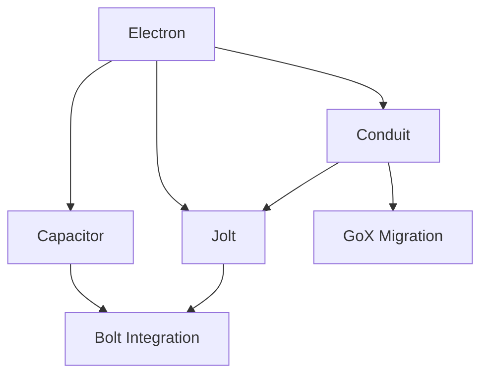

# Watt Framework Implementation Roadmap

## Overview
Complete implementation roadmap for the Watt high-performance web framework, comprising interconnected electrical components that deliver blazing-fast web applications.

## Component Overview

### ⚡ Core Components

1. **Electron** (Shared Internals) - Foundation layer
   - High-performance memory management (ArenaOfPools)
   - CPU optimizations (SIMD, cache-aware algorithms)
   - Lock-free data structures
   - Zero-cost abstractions

2. **Capacitor** (Data Access Layer) - Route & metadata storage
   - Cache-friendly data structures
   - Two-step route pre-compilation
   - SIMD-accelerated lookups
   - Zero-allocation access

3. **Conduit** (Templating Engine) - Type-safe SSR
   - Complete rewrite of GoX using Electron internals
   - Zero reflection, compile-time type safety
   - Component-based architecture
   - Automatic XSS protection

4. **Jolt** (Partial Updates) - AJAX without JavaScript
   - htmx-inspired hypermedia system
   - HTML-over-the-wire
   - Progressive enhancement
   - Seamless Conduit integration

## Implementation Phases

### Phase 1: Foundation (Weeks 1-2)
**Focus: Electron Core**

Start with Electron as it provides the fundamental primitives all other components depend on:

```
Week 1: Memory Management
- [ ] Arena allocators
- [ ] Object pooling system
- [ ] ArenaOfPools strategy (36% performance gain)
- [ ] Buffer management

Week 2: CPU Optimizations
- [ ] SIMD operations with fallbacks
- [ ] Fast hash functions
- [ ] Bit manipulation utilities
- [ ] String interning
```

**Deliverables:**
- Core Electron package functional
- Memory benchmarks showing zero allocations
- SIMD operations with automatic fallback

### Phase 2: Data Layer (Weeks 3-4)
**Focus: Capacitor**

Build the high-performance data access layer using Electron primitives:

```
Week 3: Core Data Structures
- [ ] FlatHashMap for static routes
- [ ] CompactRadix for dynamic routes
- [ ] Two-step route analysis
- [ ] Integration with Electron arenas

Week 4: Advanced Features
- [ ] SIMD batch operations
- [ ] Metadata caching
- [ ] Lock-free readers
- [ ] Bolt framework integration
```

**Deliverables:**
- Route lookup <100ns for static routes
- Zero allocation lookups
- 75% memory reduction vs standard router

### Phase 3: Templating Core (Weeks 5-6)
**Focus: Conduit Foundation**

Rewrite GoX templating using Electron's high-performance internals:

```
Week 5: Component System
- [ ] Core component interface
- [ ] HTML element builders
- [ ] Zero-allocation rendering
- [ ] Integration with Electron pools

Week 6: Type Safety & Control Flow
- [ ] Typed components
- [ ] Conditional rendering
- [ ] Loop constructs
- [ ] Automatic HTML escaping with SIMD
```

**Deliverables:**
- 10x faster rendering than GoX
- 95% reduction in allocations
- Full HTML5 element coverage

### Phase 4: Interactivity (Weeks 7-8)
**Focus: Jolt**

Implement the partial update system for dynamic UX:

```
Week 7: Core Protocol
- [ ] Request/response protocol
- [ ] Server-side API
- [ ] Swap strategies
- [ ] Multi-target updates

Week 8: Client Engine
- [ ] JavaScript library (<10KB)
- [ ] Attribute system
- [ ] WebSocket support
- [ ] Request coordination
```

**Deliverables:**
- Client library <10KB minified
- Zero-JavaScript fallback mode
- Seamless Conduit integration

### Phase 5: Integration (Weeks 9-10)
**Focus: Component Integration**

Bring all components together into a cohesive framework:

```
Week 9: Cross-Component Integration
- [ ] Conduit + Jolt integration
- [ ] Capacitor + Bolt routing
- [ ] Electron shared across all
- [ ] Configuration system

Week 10: Performance Optimization
- [ ] End-to-end benchmarking
- [ ] Memory profiling
- [ ] CPU hot path optimization
- [ ] Cache optimization
```

**Deliverables:**
- All components working together
- Performance benchmarks exceeding targets
- Memory usage optimized

### Phase 6: Production Ready (Weeks 11-12)
**Focus: Polish & Migration**

Final preparation for production use:

```
Week 11: GoX Migration
- [ ] GoX compatibility layer
- [ ] Migration tools
- [ ] Performance comparison
- [ ] Documentation

Week 12: Testing & Documentation
- [ ] Comprehensive test suites
- [ ] Performance regression tests
- [ ] API documentation
- [ ] Example applications
```

**Deliverables:**
- 100% GoX compatibility
- Complete documentation
- 5+ example applications
- Migration guide from GoX

## Dependency Graph



## Critical Path

The critical path for implementation:

1. **Electron** (Weeks 1-2) - MUST complete first as everything depends on it
2. **Capacitor** (Weeks 3-4) - Can start once Electron memory management is done
3. **Conduit** (Weeks 5-6) - Can start once Electron is complete
4. **Jolt** (Weeks 7-8) - Can develop client/server in parallel
5. **Integration** (Weeks 9-10) - Requires all components
6. **Production** (Weeks 11-12) - Final polish

## Resource Allocation

### Parallel Development Opportunities

After Electron is complete (Week 2), these can be developed in parallel:
- **Track 1**: Capacitor (1 developer)
- **Track 2**: Conduit (1 developer)
- **Track 3**: Jolt client library (1 developer)

This parallel approach can reduce timeline from 12 weeks to 8-9 weeks with 3 developers.

## Performance Targets

### Overall Framework Targets
- Request latency: <100μs for static routes
- Throughput: >500K req/sec
- Memory per request: <100 bytes
- Template rendering: <1ms for typical page
- Partial updates: <5ms round trip

### Component-Specific Targets

**Electron:**
- Arena allocation: <10ns
- SIMD string ops: 10GB/s
- Lock-free queue: 10M ops/sec

**Capacitor:**
- Static route: <100ns lookup
- Dynamic route: <200ns lookup
- Zero allocations

**Conduit:**
- 10x faster than GoX
- 95% fewer allocations
- SIMD HTML escaping

**Jolt:**
- Client: <10KB minified
- Response: <5ms server time
- DOM update: <16ms (60fps)

## Risk Management

### High-Risk Items

1. **SIMD Compatibility**
   - Risk: Not available on all architectures
   - Mitigation: Automatic scalar fallbacks
   - Owner: Electron team

2. **GoX Migration Complexity**
   - Risk: Breaking changes for users
   - Mitigation: Compatibility layer, migration tools
   - Owner: Conduit team

3. **Lock-Free Complexity**
   - Risk: Concurrency bugs
   - Mitigation: Start with mutex, optimize later
   - Owner: Electron team

4. **Browser Compatibility (Jolt)**
   - Risk: Modern JavaScript features
   - Mitigation: Progressive enhancement, polyfills
   - Owner: Jolt team

## Success Metrics

### Week 2 Checkpoint
- [ ] Electron memory management complete
- [ ] Zero-allocation benchmarks passing
- [ ] SIMD operations functional

### Week 4 Checkpoint
- [ ] Capacitor route lookup <100ns
- [ ] 75% memory reduction achieved
- [ ] Integration with Bolt working

### Week 6 Checkpoint
- [ ] Conduit 10x faster than GoX
- [ ] All HTML5 elements supported
- [ ] Type-safe templates working

### Week 8 Checkpoint
- [ ] Jolt client <10KB
- [ ] Partial updates functional
- [ ] WebSocket support working

### Week 10 Checkpoint
- [ ] All components integrated
- [ ] Performance targets met
- [ ] Memory usage optimized

### Week 12 Final
- [ ] GoX migration complete
- [ ] Documentation complete
- [ ] Example apps built
- [ ] Production ready

## Testing Strategy

### Unit Testing
- Each component: >90% coverage
- Electron: Extensive unsafe operation tests
- Capacitor: Fuzz testing for routes
- Conduit: XSS protection validation
- Jolt: Client/server protocol tests

### Integration Testing
- End-to-end request flow
- Component interaction tests
- Performance regression tests
- Memory leak detection

### Load Testing
- 100K concurrent connections
- 1M requests/second sustained
- 24-hour stability test
- Memory growth monitoring

## Documentation Requirements

### For Each Component
1. API Reference
2. Getting Started Guide
3. Performance Tuning Guide
4. Migration Guide (for Conduit/GoX)
5. Architecture Decision Records (ADRs)

### Framework-Level
1. Installation Guide
2. Quick Start Tutorial
3. Component Integration Guide
4. Production Deployment Guide
5. Performance Benchmarks

## Example Applications

Build these to validate the framework:

1. **Hello World** - Minimal setup
2. **Todo App** - CRUD with Jolt updates
3. **Blog Platform** - SSR with Conduit
4. **Real-time Chat** - WebSocket + Jolt
5. **E-commerce Site** - Full-featured app
6. **Dashboard** - Complex interactions
7. **API Gateway** - High-performance routing

## Team Structure (if multiple developers)

### Optimal Team Size: 3-4 developers

**Developer 1: Foundation**
- Lead: Electron implementation
- Support: Integration, testing

**Developer 2: Data & Routing**
- Lead: Capacitor implementation
- Support: Bolt integration

**Developer 3: User Interface**
- Lead: Conduit implementation
- Support: GoX migration

**Developer 4: Interactivity** (optional)
- Lead: Jolt implementation
- Support: Example applications

## Conclusion

This roadmap provides a clear path to implementing the Watt framework with:
- **12-week timeline** (8-9 weeks with parallel development)
- **Clear dependencies** between components
- **Measurable success metrics** at each phase
- **Risk mitigation strategies** for complex areas
- **Performance targets** based on proven benchmarks

The electrical architecture metaphor guides the implementation:
- Electron provides the fundamental energy (primitives)
- Capacitor stores and delivers that energy (data)
- Conduit channels it safely (templating)
- Jolt delivers targeted bursts (updates)

Together, they form a high-performance, type-safe, zero-allocation web framework that delivers on the promise of **maximum power, minimal overhead**.